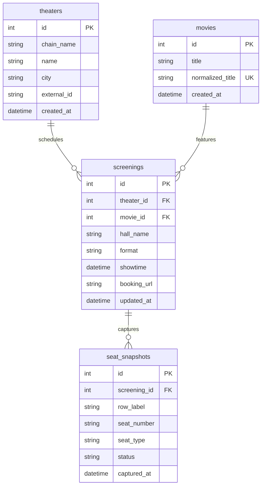

# Cinema Showtime & Real-Time Seat Availability Aggregation Engine

A production-grade, asynchronous cinema showtime and seat availability aggregation engine in Python using Playwright, SQLAlchemy 2.0+, and Pydantic v2. Designed for high-volume data ingestion across theater chains in Taiwan (including Showtime Cinemas 秀泰影城 and Vie Show Cinemas 威秀影城).

---

## 1. System Architecture

```text
cinema_crawler/
├── pyproject.toml              # Build & dependency declarations
├── README.md                   # Comprehensive architecture & operational guide
├── cinema_data.db              # SQLite database (auto-generated)
├── cinema_scraper/
│   ├── __init__.py
│   ├── config.py               # Global settings, browser configurations, rate limiting
│   ├── database/
│   │   ├── __init__.py
│   │   ├── models.py           # SQLAlchemy 2.0 async declarative models
│   │   └── session.py          # Async engine, connection pool, and atomic upsert operations
│   ├── schemas/
│   │   ├── __init__.py
│   │   └── cinema.py           # Pydantic v2 validation models & Enums (SeatStatus, SeatType)
│   ├── core/
│   │   ├── __init__.py
│   │   ├── browser.py          # Playwright stealth browser manager & context builder
│   │   ├── rate_limiter.py     # Token bucket + randomized human-like jitter limiter
│   │   └── exceptions.py       # Custom hierarchical exception taxonomy
│   ├── parsers/
│   │   ├── __init__.py         # Parser registry & dynamic loader
│   │   ├── base.py             # Abstract Base Parser (ABC) defining interface contract
│   │   ├── showtime.py         # Showtime Cinemas (秀泰影城) implementation
│   │   └── vieshow.py          # Vie Show Cinemas (威秀影城) implementation
│   ├── engine.py               # Asynchronous pipeline (Fetch -> Parse -> Store)
│   └── cli.py                  # Typer-powered CLI entry point
└── tests/
    ├── test_schemas.py         # Pydantic validation & computed properties
    ├── test_models.py          # Relational models & constraints
    ├── test_database.py        # Async SQLite CRUD & seat snapshot refresh
    ├── test_rate_limiter.py    # Token bucket & jitter delay verification
    ├── test_parsers.py         # JSON seat decoding & status mapping tests
    └── test_engine.py          # Full pipeline orchestration mock tests
```

---

## 2. Key Features & Design Invariants

- **Dual-Mode Extraction (Network Priority with DOM Fallback):**
  - **Network Interception:** Prioritizes intercepting JSON payloads (`seats/list/`, `events/seatsAvailability`, `/vsTicketing/`) generated during browser navigation.
  - **DOM / SVG Traversal:** Falls back to SVG coordinates (`<rect>`, `<circle>`, `<g>`) and CSS state selectors (`.seat-empty`, `.seat-sold`, `bg-gray-200`) when endpoints are obfuscated.
- **Session Release & Non-Locking Invariant:**
  - Strictly read-only scraping. Never finalizes checkout or holds seats permanently.
  - Automatically navigates back/cancels, disposes isolated `BrowserContext` objects, and flushes session cookies.
- **Stealth & Anti-Detection:**
  - Injected stealth scripts override `navigator.webdriver = false`, configure realistic `navigator.plugins`, and inject Taiwan locale (`zh-TW`).
  - Emulates desktop Chrome window dimensions (1920x1080) with modern headers.
- **Concurrency & Resilience:**
  - `asyncio.Semaphore(value=2)` bounds parallel browser contexts.
  - Token bucket rate limiter with randomized human jitter (2.0s – 4.5s).
  - Exponential backoff retry via `tenacity` on transient network timeouts.
- **Drop-in PostgreSQL Migration:**
  - Built on SQLAlchemy 2.0 async engine (`create_async_engine`).
  - Swapping `sqlite+aiosqlite:///./cinema_data.db` to `postgresql+asyncpg://...` requires no ORM or query changes.

---

## 3. Database Schema



---

## 4. Installation & Setup

### Prerequisites
- Python 3.10+ (tested on Python 3.12)
- Playwright Chromium binary

```bash
cd cinema_crawler

# 1. Create and activate virtual environment
python3 -m venv .venv
source .venv/bin/activate

# 2. Install dependencies
pip install -e .

# 3. Install Playwright browser
playwright install chromium
```

---

## 5. CLI Usage Guide

Run the CLI using `python -m cinema_scraper.cli`:

### 5.1 Run Scraper
```bash
# Run Showtime scraper for tomorrow in headless mode (default)
python -m cinema_scraper.cli run --chain showtime --date 2026-10-05 --headless --concurrency 2

# Run with a limit on screenings (fast verification)
python -m cinema_scraper.cli run --chain showtime --date 2026-10-05 --limit 5

# Run in headed visual mode
python -m cinema_scraper.cli run --chain showtime --date 2026-10-05 --headed --limit 2

# Run Vie Show Cinemas scraper
python -m cinema_scraper.cli run --chain vieshow --date 2026-10-05 --limit 5

# Run all configured cinema chains
python -m cinema_scraper.cli run --chain all --date 2026-10-05
```

### 5.2 Verify Database Records
```bash
# Query and display database verification metrics (seats, occupancy rates, showtimes)
python -m cinema_scraper.cli verify
```

---

## 6. Running Tests

```bash
cd cinema_crawler
pytest -v
```

All 11 unit and integration tests execute in <1s and verify:
- Pydantic schema validation & status enums
- SQLAlchemy models, unique constraints, and foreign key cascades
- Concurrency-safe theater and movie upserts
- Token bucket rate limiter and humanized jitter delays
- Showtime and VieShow seat JSON decoding
- Full end-to-end engine mock pipeline

---

## 7. Adding a New Theater Chain Adapter

To add support for a new theater chain (e.g. Ambassador Cinemas 國賓影城):

1. **Subclass `BaseCinemaParser`** in `cinema_scraper/parsers/ambassador.py`:
   ```python
   from cinema_scraper.parsers.base import BaseCinemaParser
   from cinema_scraper.schemas.cinema import ScreeningSchema

   class AmbassadorParser(BaseCinemaParser):
       @property
       def chain_name(self) -> str:
           return "Ambassador"

       async def get_schedule(self, page, date_str: str) -> list[ScreeningSchema]:
           # Navigate schedule page and return ScreeningSchema items
           ...

       async def extract_seat_map(self, context, screening: ScreeningSchema) -> ScreeningSchema:
           # Open page in context, intercept JSON or parse DOM, release session
           ...
   ```
2. **Register in `cinema_scraper/parsers/__init__.py`**:
   ```python
   PARSER_REGISTRY["ambassador"] = AmbassadorParser
   ```
The CLI and orchestration engine will automatically support `--chain ambassador`.
